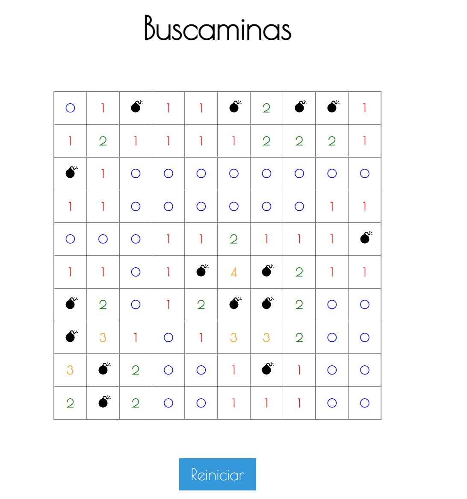
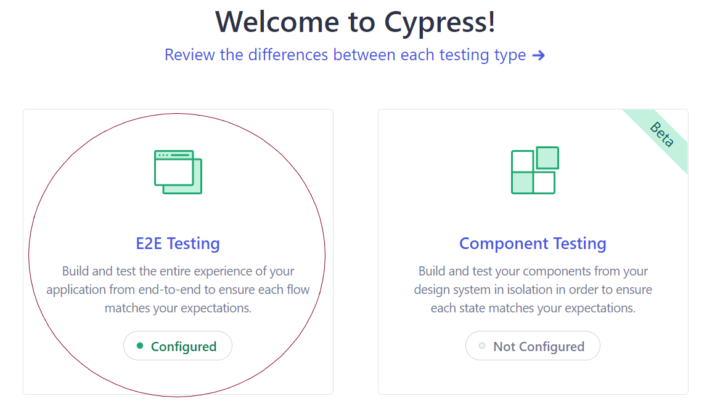
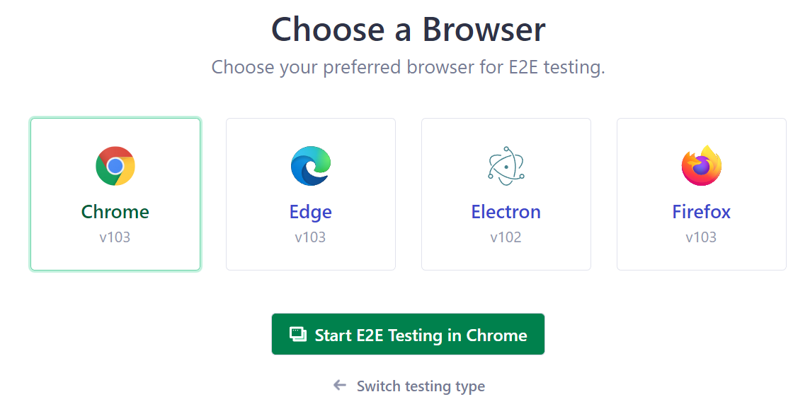
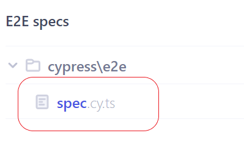

# Buscaminas

This project was generated with [Angular CLI](https://github.com/angular/angular-cli) version 14.1.0.

## Requirements

* The whole project is based on angular, so you need to install it
* Install npm for package management
* In the root folder of "buscaminas" you need to run **npm i** for project dependencies
* You should run the follow command -> **npm install -g cypress**

## Includes

* Prettier for automatically text formatting
* EsLint
* Cypress for test e2e
* Karma/jasmine for some unit tests
* Typescript for types of cypress

## How to play

* Left click to show content of the boxes
* Right click to put flags

## Development server

Run `ng serve` for a dev server. Navigate to `http://localhost:4200/`. The application will automatically reload if you
change any of the source files.

## Code scaffolding

Run `ng generate component component-name` to generate a new component. You can also
use `ng generate directive|pipe|service|class|guard|interface|enum|module`.

## Build

Run `ng build` to build the project. The build artifacts will be stored in the `dist/` directory.

## Methodology for testing

* TDD

## Running unit tests

Run `ng test` to execute the unit tests via [Karma](https://karma-runner.github.io).

## Running end-to-end tests

Run `ng e2e` to execute the end-to-end tests via [Cypress](https://docs.cypress.io/guides/overview/why-cypress)

# Quick Guide

## Lint

Run `ng lint` to find problems in the app

## Copyright ©

**Nicolas Lavanderos**
